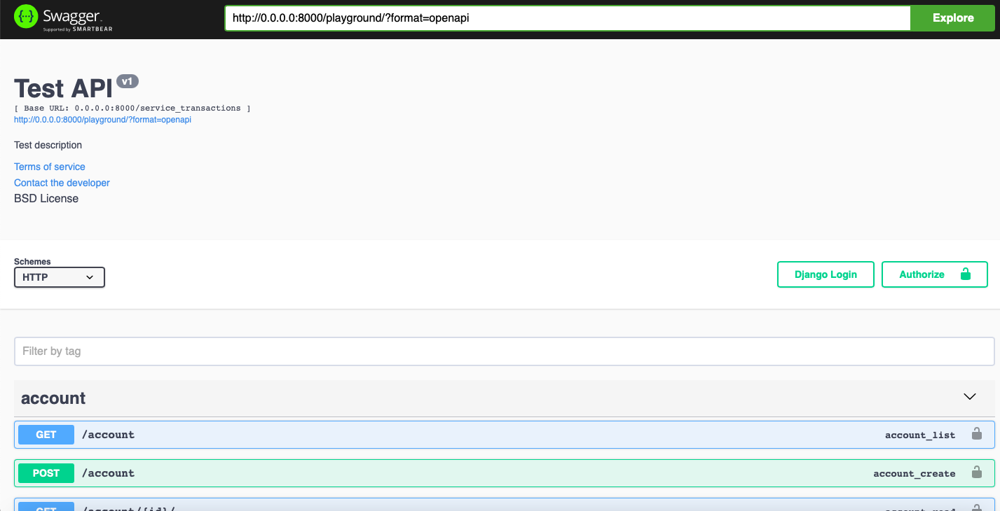

# server_of_transactions
Тестовое задание Python JuniorСоздать web-сервис биллинг. Сервис должен предоставлять 3 endpoint-а по управлению счетами:
1. Создать счет. Входные парамеры: название, флаг овердрафности(true – возможен нелимитированный уход в минус). Результат: идентификатор счета.
2. Перевести деньги со счета А на счет Б. Входные параметры: идентификатор счета донора, идентификатор счета реципиента, сумма перевода. Результат: успех или нет
3. Запрос баланса счета. Входные параметры: идентификатор счета. Результат: сумма

Данные о счетах и операциях по ним должны храниться в реляционной СУБД
Выполнить сервис на базе DRF с СУБД postgresql.
Покрыть код автотестами, юнит тестами и интеграционными тестами (По возможности)
Использовать Docker.

# Запустить сервер
Склонировать проэкт, затем запустить сборку образа с Django 
    
    cd deploy
    docker-compose build

После того как образ собрался, запускаем docker-compose

    docker-compose up -d

Через некоторое врея документация swagger к серверу будет доступна по 
пути http://0.0.0.0:8000/playground/

